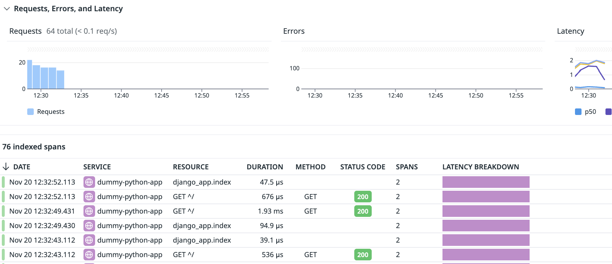
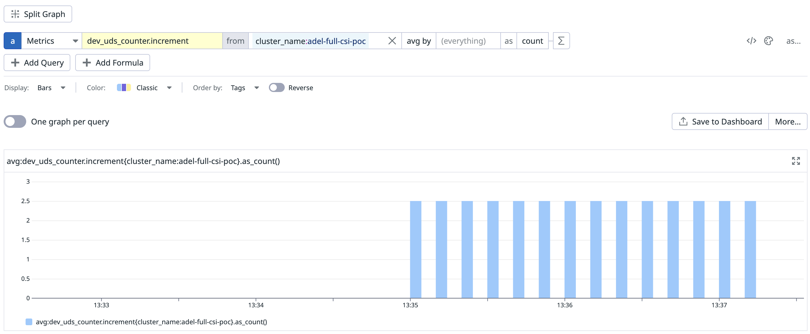
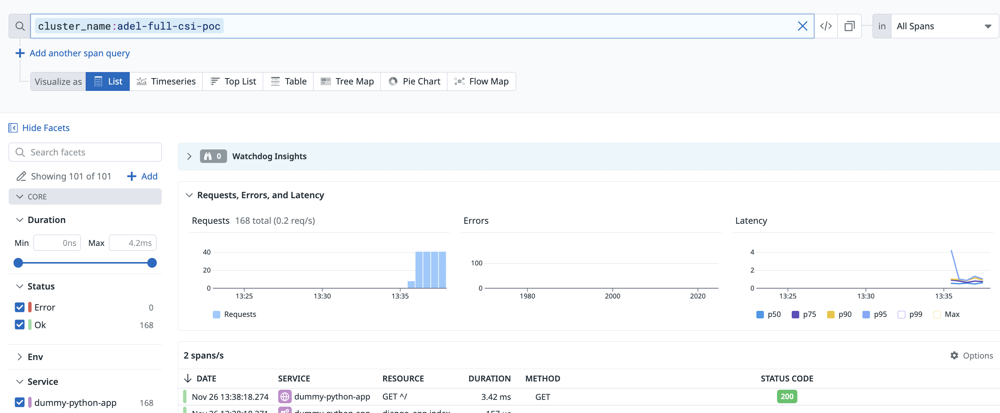
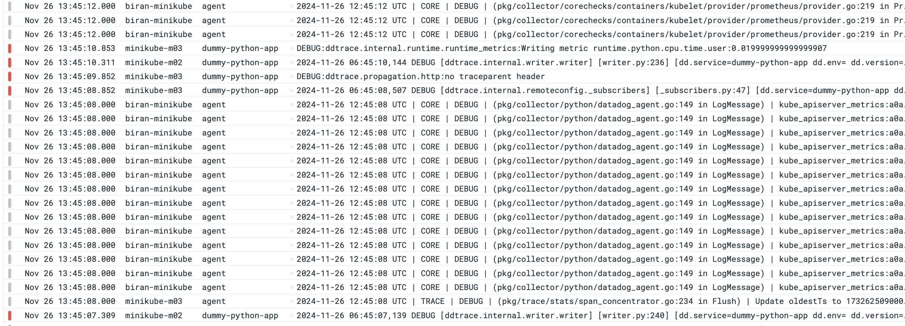

# Datadog CSI Plugin POC

## Introduction

This repository contains a proof-of-concept of a Datadog CSI driver implementation.

The goal is to be able to mount hostpath dynamically onto user applicative pods or datadog agents without needing to mount volumes with hostpath types. Mounting such volumes needs to be avoided because it doesn't adhere to the minimal baseline [pod security standards](https://kubernetes.io/docs/concepts/security/pod-security-standards/) defined by kubernetes.

Additionally, this can be an opportunity to minimise pod startup time for APM SSI by caching tracing libraries on the host using CSI Node Server and mounting CSI volumes to instrumented user pods instead of mounting emptyDirs and init containers, which results in multiple pulls and data duplication, increase memory usage and pod startup time.

## Components

This project includes the following components:

- **CSI Driver**: The crucial component that implements the CSI interface, allowing Kubernetes to manage storage solutions dynamically.
- **Dockerfile**: Used to build the CSI driver's container image, ensuring compatibility across different architectures.
- **Deployment Manifests**: Kubernetes YAML files for deploying the CSI driver as a DaemonSet, along with the necessary RBAC configurations for authorization.
- **Demo Manifests**: Used to test the CSI driver and explore its functionality.

## Building

### Prerequisites

- Docker with Buildx support enabled.
- Go 1.22 or later.

### Build Instructions

1. **Prepare the Build Environment**:

   Create a new Docker Buildx builder instance to support multi-platform builds:

    ```sh
    docker buildx create --name mymultiarchbuilder --use
    docker buildx inspect --bootstrap
    ```

2. **Compile and Push the Container Image**:

    Build and push the multi-architecture image by running:

    ```bash
    docker buildx build --platform linux/amd64,linux/arm64 \
      -t <your-repo>/<your-csi-driver-image>:<tag> \
      --push \
      .
    ```

    Make sure to replace `<your-repo>`, `<your-csi-driver-image>`, and `<tag>` with your container registry details and desired image tag.

## Demo

### Prerequisites

- A Kubernetes cluster.
- `kubectl`, configured to communicate with your cluster.

In this repository, we include 2 demos:

### General Demo

This demo includes a CSI Node Server implementation which mounts a directory from the host to the user pod as a CSI volume.

The directory is automatically created by the Node Server if it doesn't already exist on the node.

The volume is ephemeral, but data is persistent on the node.

Here are the steps to try this out:

1. Create a kubernetes cluster (or connect to an existing one):
```
minikube start --nodes 3
```
2. Deploy the CSI node server
```
kubeclt apply -f ./deloy/general-poc
```
3. Observe that the csi driver and CSI node server pods are created and running:
```
kubectl get csidrivers
NAME                 ATTACHREQUIRED   PODINFOONMOUNT   STORAGECAPACITY   TOKENREQUESTS   REQUIRESREPUBLISH   MODES                  AGE
example.csi.driver   false            true             false             <unset>         false               Persistent,Ephemeral   67s

kubectl get pods --watch
NAME             READY   STATUS              RESTARTS   AGE
dummy-ds-2qkzw   0/1     ContainerCreating   0          4s
dummy-ds-c52xr   0/1     ContainerCreating   0          4s
dummy-ds-xfqpz   0/1     ContainerCreating   0          4s
dummy-ds-2qkzw   1/1     Running             0          9s
dummy-ds-c52xr   1/1     Running             0          10s
dummy-ds-xfqpz   1/1     Running             0          11s
```
4. Create a dummy daemonset that requests a CSI volume from the CSI driver
```
kubectl apply -f ./demo/general
```
5. Exec into one of the daemonset pods, and discover what's in `/data-mount`
6. Write a file into `/data-mount`
7. Delete and recreate the daemonset, and ensure that the newly created pod can see the same created file (data persistence).

### APM SSI Demo

This demo includes a CSI Node Server implementation which leverages CSI plugin capability and DCA's admission controller to minimise pod startup time for pods instrumented with APM SSI.

The CSI Node Server will install and setup APM tracing libraries on each host, and will mount the APM directory from the host using overlayFS to allow write access in isolation across pods.

The datadog cluster agent will ensure the injection of the CSI volume instead of injecting an emptyDir volume and 5 init containers as was done previously.

Here are the steps to try this out:

1. Create a kubernetes cluster (or connect to an existing one):
```
minikube start --nodes 3
```
2. Deploy the CSI node server
```
kubectl apply -f ./deploy/apm-ssi-poc
```
3. Observe that the csi driver and CSI node server pods are created and running:
```
kubectl get csidrivers
kubectl get pod -n kube-system -l=app=dd-csi-node-server -o wide

NAME                 ATTACHREQUIRED   PODINFOONMOUNT   STORAGECAPACITY   TOKENREQUESTS   REQUIRESREPUBLISH   MODES                  AGE
example.csi.driver   false            true             false             <unset>         false               Persistent,Ephemeral   17s
NAME                       READY   STATUS     RESTARTS   AGE   IP           NODE           NOMINATED NODE   READINESS GATES
dd-csi-node-server-d5lpl   0/2     Init:2/5   0          17s   172.18.0.7   kind-worker    <none>           <none>
dd-csi-node-server-r7wvd   0/2     Init:2/5   0          17s   172.18.0.3   kind-worker2   <none>           <none>
```
4. Deploy datadog agent with cluster agent and apm ssi enabled in the default namespace
```
kubectl create secret generic datadog-secret --from-literal api-key=$DD_API_KEY --from-literal app-key=$DD_APP_KEY
helm install datadog-agent -f ./demo/apm-ssi/helm/values.yaml datadog/datadog
```
5. Once the cluster agent is up and running, create a dummy python app which should produce python traces when instrumented
```
kubectl apply -f ./demo/apm-ssi/python-app.yaml
```
6. Verify that APM python traces are generated in the Datadog UI


### Dogstatsd and Logs Agent Demo

This demo includes a CSI Node Server implementation which leverages CSI plugin capability and DCA's admission controller to minimise pod startup time for pods instrumented with APM SSI.

It also leverages the CSI and the admission controller to replace injected hostpath volumes by datadog csi volumes in order to enable dogstatsd communication / apm tracing via uds socket.

The CSI Node Server will install and setup APM tracing libraries on each host, and will mount the APM directory from the host using overlayFS to allow write access in isolation across pods.

The DCA admission controller will use CSI volumes whenever possible to avoid injecting hostpath volumes.

Here are the steps to try this out:

1. Create a kubernetes cluster (or connect to an existing one):
```
minikube start --nodes 3
```

2. Pull the modified helm chart

The POC helm chart can be found [here](https://github.com/DataDog/helm-charts/pull/1617).

Pull the repository, cd into it, and pull the diff with `gh pr checkout 1617`.

3. Create datadog secret

`kubectl create secret generic datadog-secret --from-literal api-key=$DD_API_KEY --from-literal app-key=$DD_APP_KEY`

4. Set the clusterName field in ./chart/datadog/values-override.yaml

For example: `clusterName: adel-full-csi-poc`

5. Install the chart in the cluster

```helm install -f ./charts/datadog/values.yaml -f ./charts/datadog/values-override.yaml datadog-agent ./charts/datadog```

6. Verify that the agents and csi node server pods are running

```
kubectl get pods -n kube-system -l=app=dd-csi-node-server
NAME                       READY   STATUS    RESTARTS   AGE
dd-csi-node-server-gbwxk   2/2     Running   0          2m29s
dd-csi-node-server-k7scp   2/2     Running   0          2m29s
dd-csi-node-server-l8qdm   2/2     Running   0          2m29s

kubectl get pods  --watch
NAME                                           READY   STATUS    RESTARTS   AGE
datadog-agent-8g2d5                            3/3     Running   0          3m22s
datadog-agent-cluster-agent-8656dd89d6-c29ph   1/1     Running   0          3m22s
datadog-agent-cwj4b                            3/3     Running   0          3m22s
datadog-agent-dlvwd                            3/3     Running   0          3m22s
```

It might take some time for the agent pods to become in the running state because initially the csi node server needs to pull the APM SSI libraries and get started first, and then the agents can start.

This is because the agents mount CSI volumes for logs agent and UDS sockets, so if the CSI node server is not yet ready to serve their requests, the kubelet will follow a retry mechanism with increasing delay until the volume mounting request succeeds.

We accept this behaviour in this POC, but in a production level implementatino we need a more optimised setup that doesn't deploy the agent if the CSI Node Server is not yet ready to serve requests.

7. Deploy a sample Dogstatsd App and Dummy Python App

```
kubectl apply -f ./demo/apm-logs-dsd
```

Notice that the created pods only have 1 injected init container:
```
datadogpy-5b7d9c6f8f-79xt9                     0/1     Init:0/1   0          4s
dummy-python-app-7f5b4d6fc6-cmfj8              0/1     Init:0/1   0          4s
dummy-python-app-7f5b4d6fc6-jjsml              0/1     Init:0/1   0          4s
datadogpy-5b7d9c6f8f-79xt9                     0/1     PodInitializing   0          5s
dummy-python-app-7f5b4d6fc6-jjsml              0/1     PodInitializing   0          5s
dummy-python-app-7f5b4d6fc6-cmfj8              0/1     PodInitializing   0          5s
```

Check that the volumes injected in the pods via the admission controller are csi volumes and not hostpath volumes. For examples, here is the volumes section in the dogstatsd pod:
```
volumes:
  - name: kube-api-access-2pfw8
    projected:
      defaultMode: 420
      sources:
      - serviceAccountToken:
          expirationSeconds: 3607
          path: token
      - configMap:
          items:
          - key: ca.crt
            path: ca.crt
          name: kube-root-ca.crt
      - downwardAPI:
          items:
          - fieldRef:
              apiVersion: v1
              fieldPath: metadata.namespace
            path: namespace
  - csi:
      driver: datadog.poc.csi.driver
      volumeAttributes:
        path: /var/run/datadog/dsd.socket
        type: socket
    name: datadog-dogstatsd
  - csi:
      driver: datadog.poc.csi.driver
      volumeAttributes:
        type: apm
    name: datadog-auto-instrumentation
  - emptyDir: {}
    name: datadog-auto-instrumentation-etc
  - csi:
      driver: datadog.poc.csi.driver
      volumeAttributes:
        path: /var/run/datadog/apm.socket
        type: socket
    name: datadog-trace-agent
```

8. Verify that you are getting the dogstatsd metrics



9. Verify that you are getting APM traces for the python app


10. Verify we are getting logs

